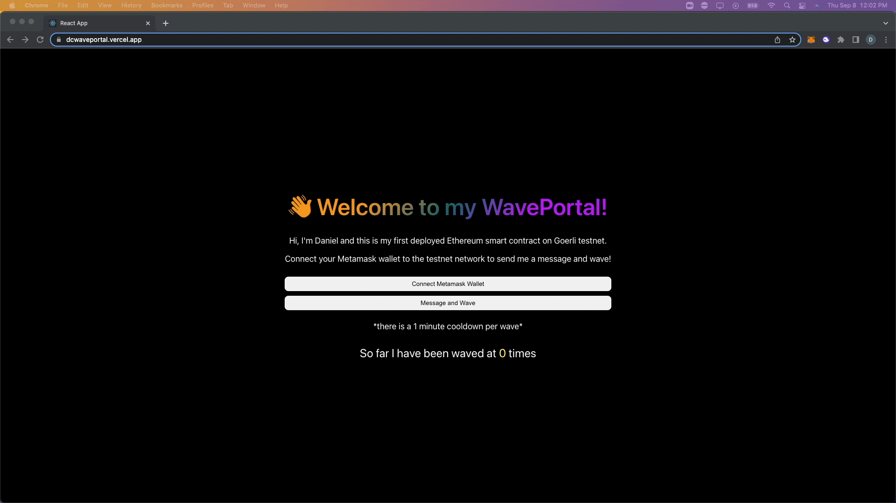
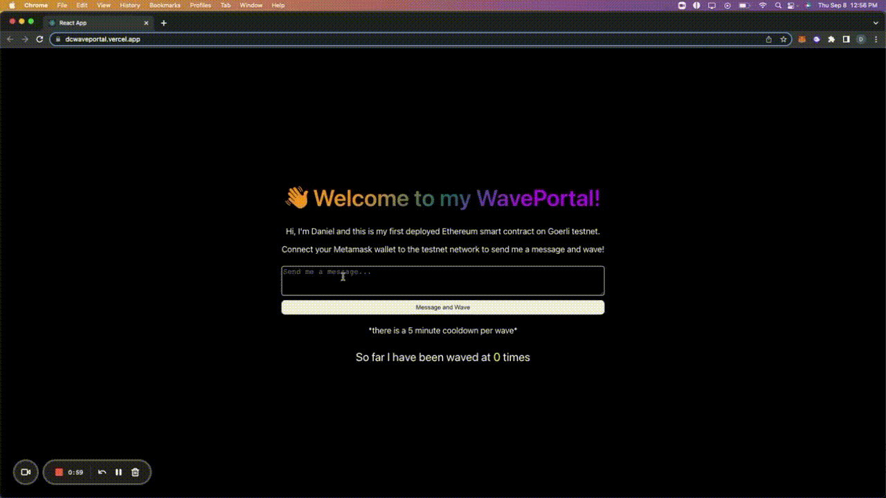

# WavePortal

This project was a Solidity tutorial from Buildspace. Front end design and deployment was handled myself while the tutorial covered using Hardhat as a development environment, writing and deploying Solidity smart contracts, and creating the connection between the contract and client. 
 
 
To watch the <a href="https://www.loom.com/share/1d3c53bee70b4612b5ffd2e527ab935a"> Demo </a>  
To visit the live website: https://dcwaveportal.vercel.app/
 
To see the github repository to the smart contract: https://github.com/danchan020/wavePortalSmartContract

## Overview

- Users are able to connect Ethereum wallet to the browser
- Users can send a message and wave on the Ethereum blockchain (testnet) after signature approval
- Wave count and messages will be updated and displayed on the front end
- Each wave will have a 50% chance of winning Goerli testnet ETH!

## To interact with the app

- Add Goerli testnet network to Metamask wallet and switch to the network
- Fund your wallet with Goerli ETH for the transaction gas fee through https://goerlifaucet.com/
- Send me a message and wave; make sure to sign and approve the transaction!

## GIFs

|  |
:-------------------------:
| Metamask wallet integration |

 

|  |
:-------------------------:
| Sending a wave and message on the ETH blockchain (testnet)|
  

